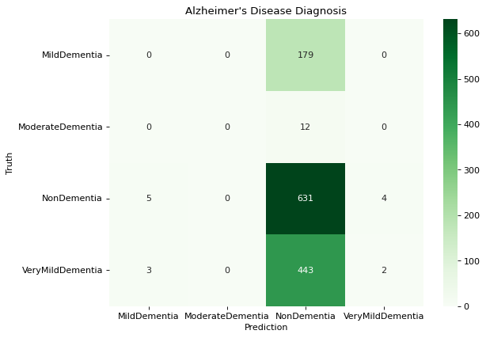
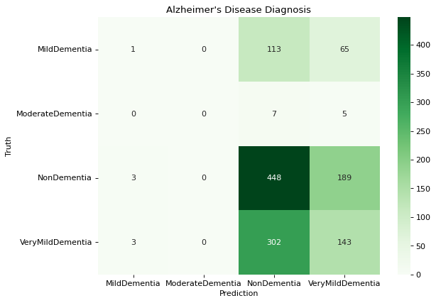

# Alzheimer's MRI Classification: An Iterative Transfer Learning Case Study

## Overview

This is a multiclass MRI classification (4 dementia stages) using InceptionV3 transfer learning, originally created as a Master's project. I ran a structured experiment across 7 architectural variants under compute constraints. Limited compute brought on by Google Colab throttling and Kaggle 1-hour GPU timeouts shaped the entire process. I could not perform large-scale hyperparameter searches, so I took an iterative "change one thing, evaluate, decide" loop for model experimentation. The project concluded with an assessment of why AUC can be misleading and a recommendation to reframe the problem.

## Dataset & The Imbalance Problem

The data is from the Kaggle Alzheimer's MRI image dataset. There are four classes of images: NonDementia, VeryMildDementia, MildDementia, ModerateDementia.

| Class | Train | Test |
|---|---|---|
| NonDementia | 2,560 | 640 |
| VeryMildDementia | 1,792 | 448 |
| MildDementia | 717 | 179 |
| ModerateDementia | 52 | 12 |

The data is very imbalanced. NonDementia has about 49x as many training samples as ModerateDementia. The imbalance becomes the central focus of the following experiments.

## Constraints & Approach

All variants used InceptionV3 pretrained on ImageNet as a base, with Adam optimizer, categorical cross-entropy loss, AUC as the primary metric, early stopping monitoring validation AUC (patience=15, restore best weights), and a 50-epoch budget (usually early stopping kicks in beforehand). AUC was chosen because it is a standard classification metric, which makes the later findings interesting because it was a reasonable standard choice. Instead of a broad/exhaustive hyperparameter search, each model variant changed an architectural element (data augmentation, regularization, normalization, pooling strategy, or number of trainable layers). Each one was based on the previous iteration's results.

## Results Across Iterations

Each row below represents one experimental iteration, showing the resulting test AUC alongside per-class recall. Some of the models have acceptable AUC, but are not accomplishing the overall goal of identifying dementia.

| # | Model variant | Test AUC | NonDementia recall | VeryMild recall | Mild recall | Moderate recall |
|---|---|---|---|---|---|---|
| 1 | Frozen InceptionV3 + Flatten + Dense(512) | 0.678 | 0.99 | 0.00 | 0.00 | 0.00 |
| 2 | + Data Augmentation + Dropout + Dense(1024) | 0.812 | 0.98 | 0.02 | 0.00 | 0.00 |
| 3 | + Class Weights | 0.384 | 0.00 | 0.00 | 0.37 | 0.67 |
| 4 | + Batch Normalization | 0.753 | 0.43 | 0.59 | 0.01 | 0.17 |
| 5 | + Max Pooling | 0.821 | 0.66 | 0.34 | 0.00 | 0.00 |
| 6 | + GlobalAveragePooling2D | 0.836 | 0.70 | 0.32 | 0.01 | 0.00 |
| 7 | + Fine-tune top 2 Inception blocks | 0.726 | 0.05 | 0.77 | 0.19 | 0.00 |

*The base model predicts almost everything as NonDementia, the same as a spam classifier saying everything is not spam and having 99% accuracy.*

*The best model by AUC still only gets 1 of 179 MildDementia cases right.*

## Why AUC Was Misleading

When computing AUC across four classes, it becomes dominated by the two largest classes. NonDementia (640) and VeryMildDementia (448) together make up 85% of the test set (1,279). If a model predicts those two classes well, it will have an increased AUC, despite hardly being able to correctly classify MildDementia or ModerateDementia — the same dynamic as the 99%-accurate spam classifier above. Between models 1 and 6, AUC increased from 0.678 to 0.836, but MildDementia recall went 0.00 → 0.01, and ModerateDementia recall stayed at 0.00. Both effectively zero across a 16-point AUC gain. As stated before, AUC was a reasonable initial metric choice. The project's value was discovering a metric-task mismatch via experimentation.

## Conclusion & Recommendation

I recommend the classes be combined as Dementia (Mild + Moderate + VeryMild) vs. NonDementia in a binary classification problem. This would have an almost perfect 50/50 class split (2,561 Dementia vs. 2,560 NonDementia) in the training set. The data imbalance issues would evaporate and AUC would become a meaningful metric again. As a side note, a binary Dementia vs NonDementia classifier is still a useful screening tool in a clinical setting. I discovered the data could support a different version of the original problem.

## Extensions / What I'd Do Differently

This project was completed during my Master's program. With my current experience, there are a few things I'd approach differently:

- Actually run the binary classification experiment. Test the recommendation above directly, rather than leaving it as a proposal.
- Use a clinically-motivated metric. In a screening context, missing a dementia case (false negative) is more costly than a false positive, so optimizing for recall/sensitivity on the "Dementia" class would be more appropriate than AUC alone.
- Broader hyperparameter search with more compute. The one-change-at-a-time approach was a direct response to the Colab/Kaggle constraints; with more compute, a proper search over learning rate, dropout, and layer sizes could find better configurations faster.
